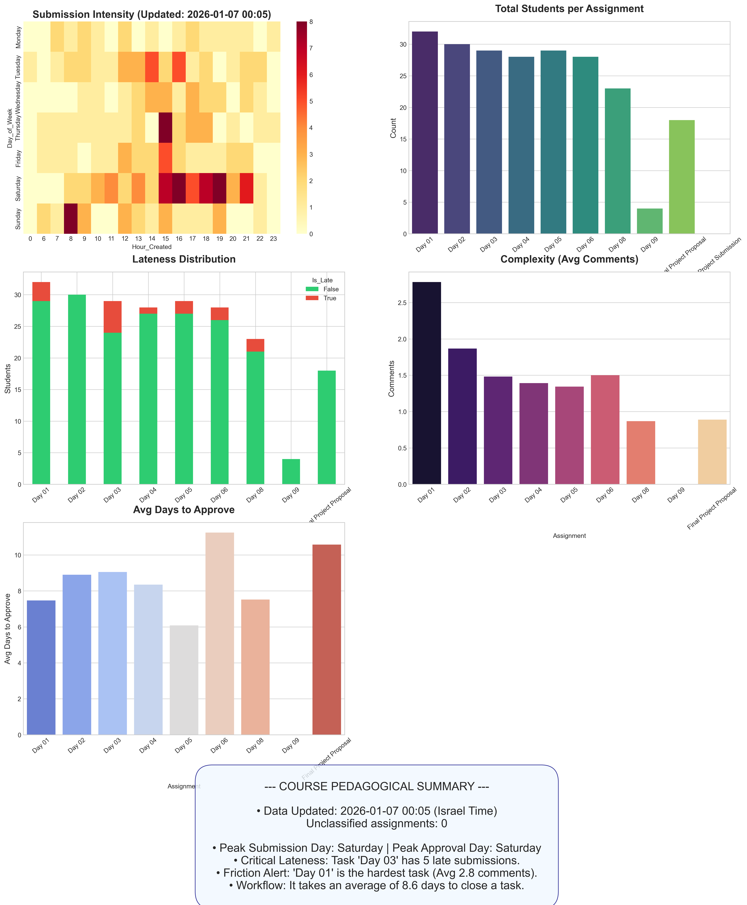

# Python Course Pedagogical Analyzer 📊

This project is a data-driven tool designed to bridge the gap between raw GitHub technical data and actionable pedagogical insights. By analyzing student submissions, comments, and resolution times, it provides course staff with a high-level view of class progress and difficulty points.

## 🌟 Key Features

* **Automated Pipeline:** Seamlessly fetches data from GitHub API and processes it into a structured CSV.
* **Intelligent Deadline Tracking:** Compares timestamps against a complex schedule spanning 2025-2026, accurately identifying late submissions.
* **Friction & Difficulty Mapping:** Uses comment counts as a proxy to identify assignments that caused the most confusion or required the most corrections.
* **Behavioral Heatmaps:** Visualizes student work habits (hours vs. days) in **Israel Standard Time (IST)**.
* **Operational Efficiency:** Tracks the time between submission and approval to monitor staff response rates.

## 💡 Example Insights (What this tool tells us)

* **Engagement:** If the "Submission Intensity" heatmap shows a peak on Saturdays, it indicates students primarily work on weekends.
* **Drop-off Rates:** A declining bar in the "Total Students per Assignment" chart can signal that the course is becoming too difficult.
* **Bottlenecks:** If "Avg Days to Approve" is rising, the teaching staff may need more resources to handle the volume.

---
## 📸 Dashboard Example

*Figure 1: Automated dashboard generated from GitHub Issue data.*

## 🛠 AI Usage & Core Methodology

This project was co-developed with **Gemini AI**, utilizing advanced data engineering principles:

1. **Disciplinary Analysis:** Handling TZ-aware vs TZ-naive timestamps to ensure 100% accuracy in lateness reporting.
2. **Pedagogical Proxy:** Applying statistical grouping to determine the "Complexity Index" of each lesson based on comment volume.
3. **Layout Engineering:** Used `matplotlib.GridSpec` to create a responsive design that prevents text overlap.

---

## 🚀 Installation & Usage

### Prerequisites

* Python 3.8+
* Libraries: `pip install requests pandas matplotlib seaborn pytz openpyxl`

### How to Sync via VS Code (Recommended)

1. **Run the Script:** This will generate `final_course_report.png` in your project folder.
2. **Stage the Image:** Open the **Source Control** tab in VS Code and click the **+** icon next to the image.
3. **Commit:** Type a message (e.g., "Updated dashboard") and click the **V** (Commit).
4. **Push:** Click **Sync Changes** to upload the image to GitHub.

---
⚠️ System Limitations & Data Integrity
System Limitations and Data Reliability:

Format Dependency: The system identifies assignments based on specific keywords (Day/Final). Any deviation from this format will cause the assignment to be classified as "Other."

External Interactions: The system only measures activity documented on GitHub. Feedback provided through parallel channels (e.g., verbal, messaging apps) is not included in the data.

Reporting Accuracy: The system does not identify cases where the code was significantly updated after the original Issue was opened; it tracks the initial submission time.

## 📁 Project Structure

* `analyzer.py`: Main unified script (Fetch + Analysis + Viz).
* `course_data_results.xlsx`: Detailed raw data for further Excel analysis.
* `final_course_report.png`: The visual dashboard displayed in this README.

**Developed for the WIS Python Course 2025-10.**

